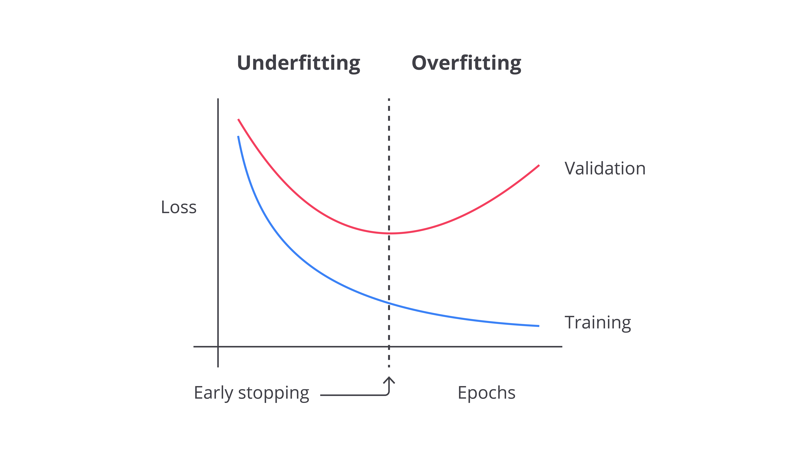

# 2026/03/11

## Accomplishments
- Nonton video yt tentang [learning curve](https://www.youtube.com/watch?v=nt5DwCuYY5c) dan [early stopping](https://youtu.be/CODw8292uqE?si=3LjDqhWrlvzBhKFW): 
    - Selama proses training, ada baiknya bikin chart learning curve kek gini: 
    
    - Tujuannya supaya ada gambaran, model ada indikasi underfitting atau overfitting atau ngga. 
    - Underfitting terjadi ketika data yang digunakan untuk melatih model masih terlalu sedikit dibandingkan apa yang ingin diuji dengan data test. Ibaratnya, siswa yang belum bisa menggeneralisir apa yang sudah dipelajarinya untuk digunakan di kehidupan nyata. 
    - Overfitting terjadi ketika model terlalu memegang teguh apa yang dipelajarinya dari data, sehingga ketika disuguhkan data test baru yang belum pernah dilihatnya, dia tetap saklek dan jadinya ga sesuai yang diharapkan. 
    - Salah satu cara menangani overfitting adalah dengan melakukan early stopping. 
    - Early stopping ibaratnya rem yang menghentikan proses training jika validation loss di learning curve sudah tidak ada indikasi menurun lagi dan justru malah menaik lagi. 

## Thoughts
- Early stopping ada kaitannya sama callback ga?

## Next Steps
- Pelajari callback, dropout, batch normalization.