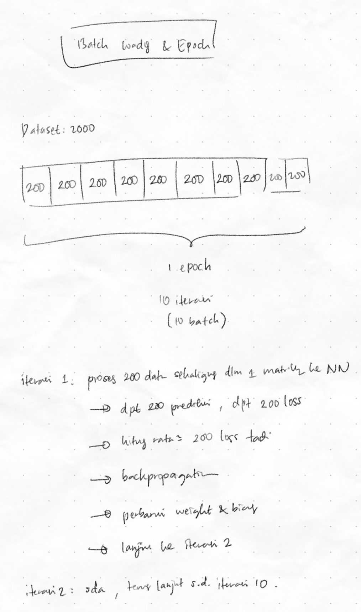

# 2026/03/14

## Accomplishments
- Nyoba ngertiin cara kerja dropout secara intuitif. Lalu beralih ke nyoba ngertiin batch loading buat tahu gambaran alur data di neural network, termasuk saat dropout diterapkan. 
- Dropout digunakan untuk mengatasi overfitting. Kalau diingat lagi, suatu model bisa mengalami overfitting karena terlalu saklek pas belajar, dalam hal ini, weights nya terlalu presisi terhadap data training. 
- Terlalu presisinya weights itu bisa terjadi, boleh jadi karena dalam sekali training epoch, kebetulan modelnya udah dapat kombinasi neuron yang bikin loss nya turun, bahkan sebelum banyak epoch terlalui. 
- Kadang atau biasanya, di antara kombinasi itu ada neuron 'andalan' yang menurunkan loss sendiri tanpa melibatkan neuron lainnya. Ibarat neuron yang nguli kerja kelompok seorang diri tanpa melibatkan neuron-neuron sekelompoknya untuk berkontribusi, sehingga ketika mereka terpecah dan menjalani hidup masing-masing, neuron-neuron yang ga dapat kesempatan nguli itu ga bisa melakukan hal sepresisi ketika mereka masih bersama neuron kuli yang belajar semuanya sendiri tanpa ngajak belajar bareng itu.
- Akibatnya, model udah keliatan pintar duluan (padahal belum) sebelum benar-benar memberi kesempatan untuk neuron-neuron lainnya dan juga si neuron kuli itu untuk belajar bareng dan menyesuaikan sinergi lagi. 
- Dengan mematikan neuron secara acak, proses training model jadi bisa dilakukan dengan lebih bervariasi, sehingga tidak ada neuron yang terlalu dominan, dan semua neuron punya kesempatan yang sama untuk belajar, alias punya kesempatan yang sama untuk diperbarui weight nya dengan lebih adil dan merata.
- Contoh epoch dan mini batch gradient descent: 

- Untuk case RNN, termasuk halnya lstm seq2seq, pastikan agar dropout tidak mematikan neuron dalam satu sequence yang sama, dalam hal ini, satu neuron RNN, sebab bisa mengacaukan ingatan RNN dalam pola yang diperoleh dari setiap timestep. Ibaratnya satu timestep dimatikan aja, ya pola nya jadi keputus dan model jadi ga tau pola sebenarnya gimana. 
- Biar aman, untuk case RNN dropout bisa dipakai di penghujung output layer aja kalau mau. 

## Thoughts
- Ini aku belum tau pasti, tapi untuk sekarang coba pegang dulu, dalam satu batch yang sama, weight dan bias antar sampel data training yang dimasukkan ke neural network adalah sama. Soalnya, dimasukkan ke neural networknya kan langsung semua sekali lahap dalam satu matriks / vektor. Terus juga pas backpropagation, yang dihasilkan sepaket weights dan biases baru untuk satu aliran network, bukan untuk dari sejumlah sampel dalam batch itu. 
- Masih belum kebayang jernih gimana aliran data di lstm seq2seq ketika dropout dilibatkan dalam batch. 

## Next Steps
- Lanjut pelajari implementasi dropout dan batch di lstm seq2seq.