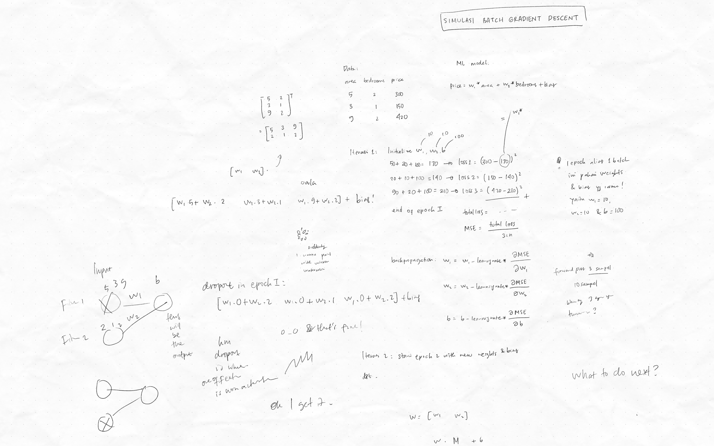

# 2026/03/15

## Accomplishments
- Ngotret simulasi batch size.

- Weight dan bias yang digunakan dalam satu batch beneran sama. Dari hasil forward propagation, didapat kompilasi hasil prediksi dari data-data dalam satu batch yang sama menggunakan weight dan bias yang sama, yang dari situ diakumulasikan menjadi satu loss function kek mse. MSE nya kemudian digunakan untuk menghitung gradient descent untuk memperbarui weight dan bias. 
- SGD --> batch size = 1, 
- Batch Gradient Descent --> batch size = jumlah seluruh data di data train
- Mini Batch Gradient Descent --> batch size = sejumlah ukuran sampel yang ditentukan
- Biasanya hasil learning curve dari SGD kan gradakan, sementara hasil dari full batch mulus. Itu bisa terjadi karena di full batch, model bisa full lihat keadaan data dan jadi langsung tahu titik paling minimum secara global, sehingga jadi ga perlu kena noise lagi kayak SGD yang cuma bisa nebak-nebak karena cuma bisa lihat dari satu sampel data aja. 

## Thoughts
- Yang namanya hyperparameter tuning, selain untuk yang di algoritma ML klasik kek GridSearch, ada yang bisa juga untuk tuning komponen training kek batch size ga? Terus juga untuk tuning jumlah layer, ada tool tuning nya juga ga?

## Next Steps
- Menyatukan kembali semua yang sudah dipelajari per tanggal 2026/02/28 sampai hari ini.